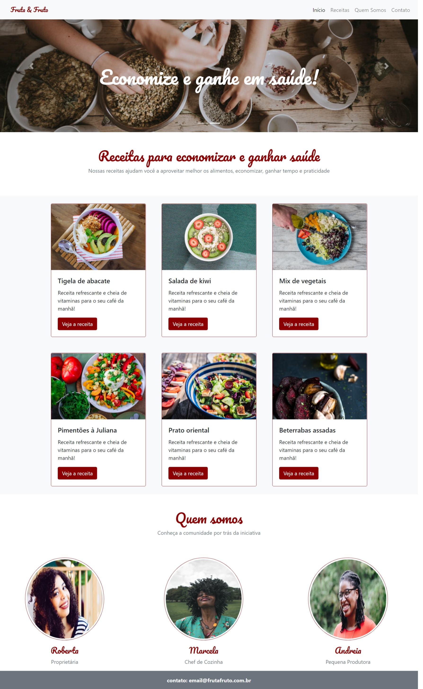

<h1 align="center">🍉 Fruta & Fruto</h1>

  <strong>Projeto realizado como forma de estudar um pouco mais as funcionalidades do Bootstrap 4</strong>

  

### Site 💻

- [Fruta & Fruto](https://fruta-e-fruto-projeto.netlify.app/)

## Linguagens: 🚀
- HTML
- CSS
- Boostrap 4
